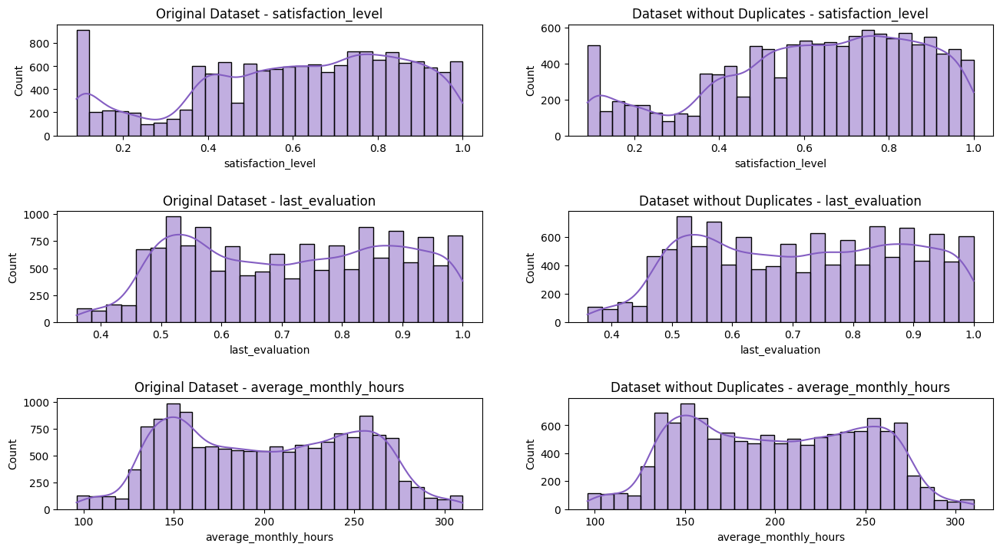
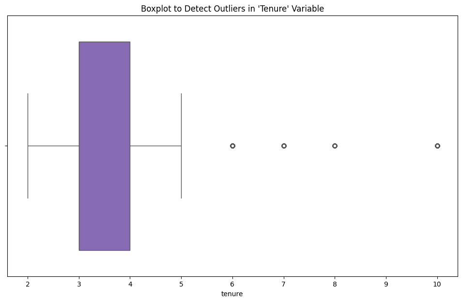
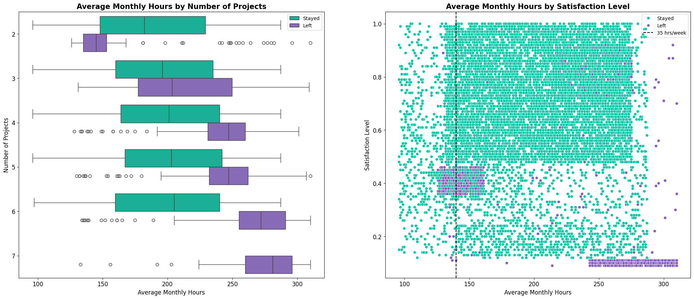
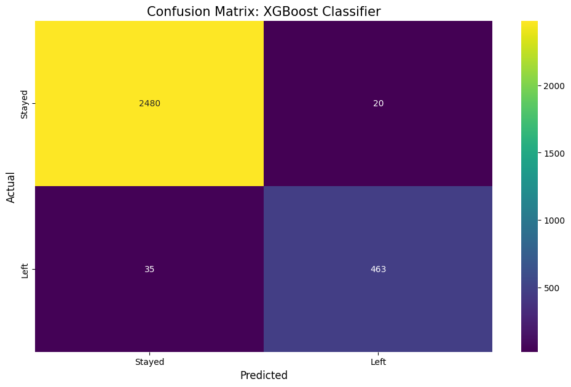
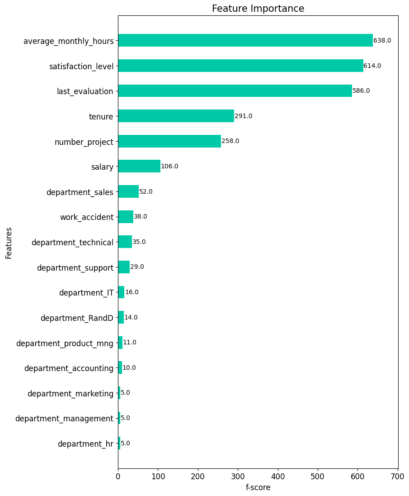

# Predicting Employee Turnover Using Machine Learning
This capstone project, completed as part of the Google Advanced Data Analytics course, aims to analyze employee data to predict turnover within the company Salifort Motors. The goal is to provide the HR department with actionable insights to improve employee satisfaction and retention.

## Table of Contents
- [Introduction](#introduction)
- [Installation](#installation)
- [Dataset](#dataset)
- [Exploratory Data Analysis](#exploratory-data-analysis)
- [Modeling and Evaluation](#modeling)
- [Conclusion](#conclusion)

## Installation
The project has been completed in Python version 3.12.3. To install the necessary Python packages for the project run:

```sh
pip install -r requirements.txt
```

## Dataset
The dataset used for the project contains 15,000 rows and 10 columns for the variables listed below. For more information about the data, refer to its source on [Kaggle](https://www.kaggle.com/datasets/mfaisalqureshi/hr-analytics-and-job-prediction?select=HR_comma_sep.csv).

Variable  |Description |
-----|-----|
satisfaction_level|Employee-reported job satisfaction level [0&ndash;1]|
last_evaluation|Score of employee's last performance review [0&ndash;1]|
number_project|Number of projects employee contributes to|
average_monthly_hours|Average number of hours employee worked per month|
time_spend_company|How long the employee has been with the company (years)
Work_accident|Whether or not the employee experienced an accident while at work
left|Whether or not the employee left the company
promotion_last_5years|Whether or not the employee was promoted in the last 5 years
Department|The employee's department
salary|The employee's salary (U.S. dollars)

## Exploratory Data Analysis 
The exploratory data analysis (EDA) showed a two issues with the data set:

- The data set contained 3008 duplicate values
- The data set contained several outliers for the 'Tenure' variable

**Duplicates:** The duplicates were removed because they did not seem to represent valid/legitimate data entries. The plot below shows the distributions before/after the removal of duplicates. As seen from the plot, the removal of duplicates did not seem to change the data distributions in any major way.



**Outliers:** The 'Tenure' variable contained 203 outliers. The outliers were kept in the data set. However, they were later removed for the Logistic Regression Model due to its sensitivity to outliers. The box plot below shows the distribution for the 'Tenure' variable.



After this initial EDA, the data was analyzed further. The main insight from the EDA was, that the employees from Saliforts Motors seemed overworked. This is also showed in the plots below, where it is clear that most leaving employees are working substantially more that a normal work week of around 35 hours.




## Modeling and Evaluation 
To predict the binary classifcation problem of employee turnover, three models were selected:

- Logistic Regression Classifier (extreme outliers were removed)
- Random Forest Classifier
- XGBoost Classifier

The XGBoost Classifier performed the best (though similar to the Random Forest Classifier). Therefore, the results of this model is presented below. The complete restults can be found in the project notebook.

### Results from XGBoost Classifier
The model was trained and tuned using 4-fold crossvalidation. The model was refit based on the recall metric. This is due to the fact that I am interested in predicting employees that actually leave. By refitting with recall in mind, I can focus on:

- **Minimizing False Negatives:** By optimizing for recall, I aim to minimize the number of false negatives (cases where the model predicts an employee will stay when they actually leave). This is crucial when the cost of missing an actual leaver is high.

- **Employee Retention Efforts:** Since the goal is to implement proactive measures to retain employees, I want to ensure that I identify as many employees at risk of leaving as possible. High recall ensures I don’t miss many of these at-risk employees.

The model was tuned across the following hyperparameters (**bold** indicates the parameters of the best performing model):

| Parameter           | Values                    |
|---------------------|---------------------------|
| `max_depth`         | [1, **3**, 6, None]           |
| `min_child_weight`  | [**3**, 5]                    |
| `learning_rate`     | [**0.1**, 0.2, 0.3]           |
| `n_estimators`      | [300, **500**, 800]           |
| `subsample`         | [**0.7**]                     |
| `colsample_bytree`  | [**0.7**, 1.0]                |

The model was trained in 2 minutes and 48 seconds. The confusion matrix below shows the performance of the model on the test data.



#### Results from Confusion Matrix
- **True Negatives:** The model correctly predicted that 2,480 employees would stay.
- **False Negatives:** The model incorrectly predicted that 20 employees would stay when they actually left. This indicates that the model doesn’t miss many employees who are leaving.
- **False Positives:** The model incorrectly predicted that 35 employees would leave when they actually stayed. This means the company won’t waste many resources if they use the model’s results to invest in retaining these employees.
- **True Positives:** The model correctly predicted that 463 employees would leave. This substantial number of correctly identified leaving employees will help the company focus efforts on retaining them.

#### Performance Metrics
- **Accuracy:** The model had an accuracy of 98 %
- **Precision:** The model had a precision of 96 %
- **Recall:** The model had a recall of 93 %
- **F1-score:** The model had a f1 score of 94 %

#### Most Important Features
The plot below shows the most important features of the model.



The most important features are:
1. Average monthly hours
2. Satisfaction level
3. Last evaluation
4. Tenure
5. Number of projects

An important consideration in this case is, if all the data will be available when the company will be trying to predict leaving employees in the future. For example, the satisfaction level may not be available for all employees since it is probably not collected that frequently (e.g. on yearly basis). Therefore, it could be relevant to create a model that do not use the satisfaction level to better approximate the performance in a real setting. However, it could also be an option to increase the frequency of data collection for the variable to ensure the availability of the data. This should be discussed with the relevant stakeholders.

## Conclusion
The initial EDA indicated that employees were overworked, and that this was correlated with leaving. This picture has been confirmed by extracting the feature importance for the XGBoost model.

In order to retain employees, the following recommendations can be presented to the stakeholders:
- Engage in dialogue with the employees about overworking. Try to understand the working culture, and investigate if steps can be taken do decrease unnecessary overwork.
- Set a cap for the number of projects that employees can be a part. It can also be considered, to cap the number of working hours or engage in dialogue with employees that reach a specific number of working hours (e.g. above 160/180)
- Investigate why high evaluations scores are strongly correlated with working many hours. Is working hours weighed disproportinately in the evaluation metrics?
- Set-up regular check-ins where teams can prioritize their tasks in order to improve time management avoid overworking on tasks that can be completed at another time. 